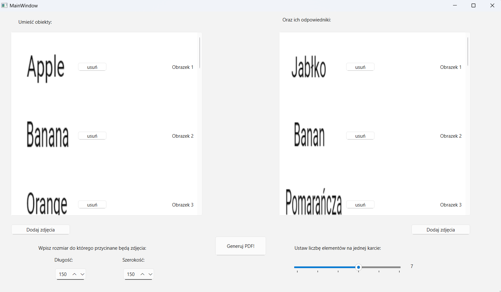

# Double-like card (Fano plane graph) generator, polish version below

**The game involves placing one group of cards on the table and distributing the other among players.** If a player finds a match with their card and a card from the common pile, they take both. The player can declare that there is **no match**, in which case other players check if they are correct. If so, they take the card, but if not, they lose a life. **For each card in set A, there is at most one match for each card in set B!**

**I recommend using 10 to 15 elements and 4-element cards for the best algorithm performance.**

## How to use the program?

1. **First, press start.** (rozpocznij)
2. **Choose the dimensions of the images** ***(this applies to all of them, you shouldn't change it later)***! (it's set to 150x150 by default)
3. **Add images so that the numbers on the right and left match.** You can move and remove images to adjust the numbering.
4. **Use the slider to choose how many elements you want on one card** (I recommend 4, 6, or 9 if you have time to wait).
5. **Save the image**. If it is empty, it means that there is no configuration for the given conditions. Try adding more images or decreasing the number of images on one card.

## TO DO
- Disect generation of mathematical abstraction (Fano-plane graphs) from card construction, you dont't need to run the algorithm every time you want to create cards!
- By making a small change in the code or adding some code, different game modes can be created. For example, **one group of cards can be significantly larger than the other.**
- You can also **remove cards that do not have a match for each card in the opposite group.**
- The algorithm's performance can be improved **by using data structures other than QVector (QMap, QSet, QHash).**
- You can add **an option to add text instead of images.**
- You can implement the algorithm using dynamic programming paradigm which will significantly improve time performance 

# Gra

**Gra polega na tym, że ustawiamy jedną grupę kart na stole, drugą rozdzielamy między graczami.** Jeśli gracz znajdzie dopasowanie ze swoją kartą i kartą ze wspólnego stosu, zabiera obie. Gracz może stwierdzić, że nie ma dopasowania, wówczas inni gracze sprawdzają, czy ma rację. Jeśli tak, zabiera kartę, a jeśli nie, traci życie. **Dla każdej karty ze zbioru A, dla każdej karty ze zbioru B istnieje maksymalnie 1 dopasowanie!**

**Zalecam korzystanie z 10 do 15 elementów i kart 4-elementowych. Wówczas algorytm działa najlepiej.**

## Jak korzystać z programu?

1. **Najpierw należy nacisnąć rozpocznij.**
2. **Wybierz wymiary obrazów** ***(tyczy się to ich wszystkich, nie powinieneś później tego zmieniać)!***
3. **Dodaj obrazy tak, aby numery po prawej i po lewej się zgadzały**. Możesz przesuwać i usuwać obrazy, aby dostosować numerację.
4. **Wybierz suwakiem, ile chcesz elementów na jednej karcie** (polecam 4, 6 lub 9, jeśli mamy czas poczekać).
5. **Zapisz obraz**. Jeśli jest pusty, oznacza to, że nie istnieje żadna konfiguracja przy zadanych warunkach. Spróbuj dodać więcej obrazków lub zmniejszyć liczbę obrazków na jednej karcie.

## TO DO
- Disect generation of mathematical abstraction (Fano-plane graphs) from card construction, you dont't need to run the algorithm every time you want to create cards!
- W grze można za pomocą niewielkiej zmiany kodu lub dodania kodu stworzyć różne tryby. Na przykład **jedna grupa kart może być znacznie liczniejsza niż druga.**
- Można także **usunąć karty, które nie mają dopasowania dla każdej karty z grupy przeciwnej.**
- Można przyspieszyć działanie algorytmu, **wykorzystując inne struktury danych** niż QVector (QMap, QSet, QHash).
- Można dodać **opcję dodawania tekstu zamiast obrazów.**
- Używając programowania dynamicznego można znacznie zwiększyć prędkość algorytmu
